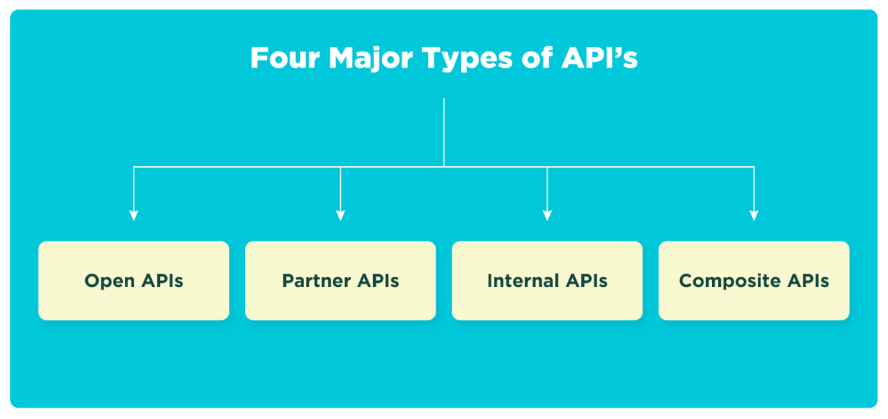

# APIs and SDK

## What is an API?

**API** is the abbreviation for Application Programming Interface. An **API** is a software interface that enables two programs to communicate with one another. In other words, an **API** acts as a messenger, delivering your request to the service provider and then returning the result to you.

## What is an API?

The Software Development Kit, or **SDK**, is exactly what its name implies. It's a software development kit (**SDK**), which is a collection of tools that allows a programmer to create a bespoke app that can be added to or connected to another program. **SDK**s enable programmers to create apps for a particular platform. **SDK**s allow developers to add extra functionality to programs, as well as provide ads and push alerts to the system

## API types

**Open APIs:**
Open APIs, also known as public APIs, have no limitations and may be expanded upon by a large number of developers over time. These APIs are open to the general public. The mechanisms are secure, but they may be accessed, added to, and modified by anybody.

**Internal APIs**
Internal APIs, often known as private APIs, are exclusively accessible by internal systems. Specific privileges or licenses are required to utilize this sort of API. These APIs are generally well-protected behind firewalls and business procedures since they contain sensitive company data that should not be made public.

**Partner APIs:**
APIs for business partners are used to collaborate with them. Partner APIs are not publicly accessible, but they are restricted to certain groups of users via authentication and permission procedures, just as internal APIs. Partner APIs, on the other hand, operate outside the organization, necessitating additional security precautions.

**Composite APIs:**
Composite APIs, as the name implies, combine several data and service APIs to provide the developer's desired output. Composite APIs execute in sequence owing to the execution, rather than being initiated by a single job. This API class improves user engagement by speeding up the process.

## The benefits of APIs

- Connecting disparate software applications for a stronger overall product offering.
- Shortening the development cycle through automation.
- Reducing resources that would otherwise need to be allocated for in-house work.
- Improving brand recognition and trust.
- Providing new services to end-users with maximum efficiency.

## The differences between API and SDK

 *API* | *SDK*
---------- |------------
 An API establishes communication between two applications. | SDK is the toolbox and all you need to build applications from scratch.
 APIs cannot contain SDKs.|An SDK may contain APIs
 APIs cannot build an. application|SDKs use APIs to make communication between two applications possible.
 An API is essentially an interface for applications. |SDKs are tools used to build applications
  APIs do not have code libraries and are easy to modify |SDKs are easy to use and faster to integrate.
APIs deliver a request from one app to another software and deliver a response back to the requesting app. |SDKs contain all you need to communicate with another software and all you need to build software.
APIs only come in when there is a need to have external communication with other platforms. |Devs always use an SDK to build apps

---

### Reference

(What is API: Definition, Types, Specifications, Documentation, 2021)
(What is an SDK? What do SDKs do? Find out here | Adjust | Adjust, 2021)
(What is an Application Programming Interface? - Jelvix, 2021)
(What’s the Difference Between an API vs an SDK? - Jelvix, 2021)
