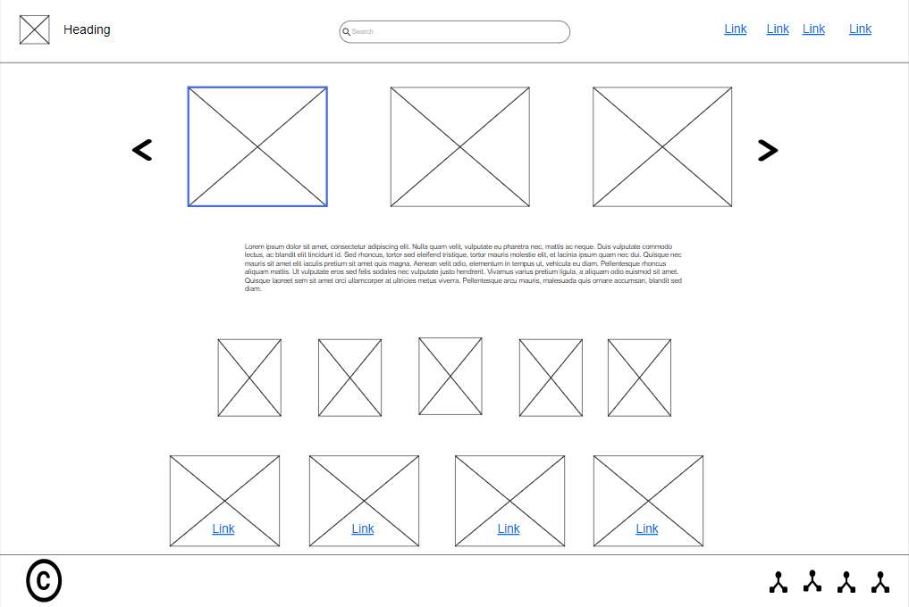
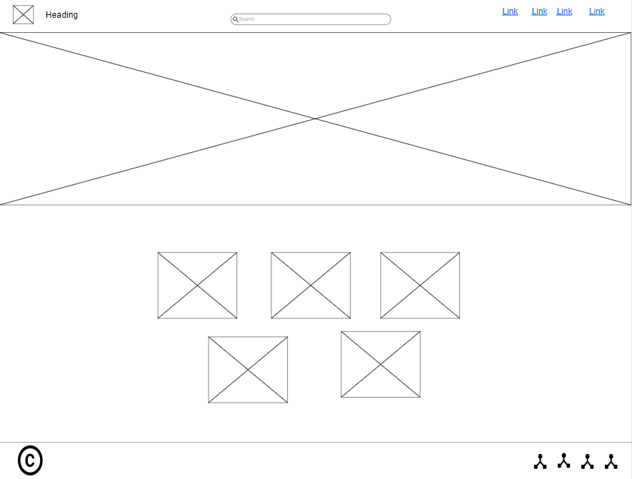

# Requirements
  
 The problem is that we have many handicrafts made at home, and there is a difficulty in marketing their products, so we decided to collect them in one place and increase trust between the seller and the customer and create a platform for handicraft makers and the difficulty in delivering the products on time and the product cannot be returned to and the difficulty of marketing the customer's products between The seller and the customer, and the difficulty of knowing the prices of products without having to communicate with the seller to find out if the product is available or not

### **Schedule Risk:**

 Project schedule get slip when project tasks and schedule release risks are not addressed properly. Schedule risks mainly affect a project  and may lead to project failure.

- Time is not estimated perfectly
- Improper resource allocation
- Tracking of resources like system, skill, staff etc
- Frequent project scope expansion
- Failure in function identification and its’ completion

### **Operational Risks:**

Operational risk refers to procedural risks means these are the risks that happen in day-to-day operational activities during project development due to improper process implementation or some external operational risks.

- Insufficient resources
- The conflict between tasks and employees
- Improper management of tasks
- No proper planning about project
- Less number of skilled people
- Lack of communication and cooperation
- Lack of clarity in roles and responsibilities
- Insufficient training

### **Technical Risks:**

Technical risks refer to the functional risk or performance risk which means this technical risk mainly associated with functionality of product or performance part of the software product.

- Frequent changes in requirement
- Less use of future technologies
- Less number of skilled employee
- High complexity in implementation
- Improper integration of modules

### **Programmatic Risks:**

Programmatic risks refers to the external risk or other unavoidable risks. These are the external risks which are unavoidable in nature. These risks come from outside and it is out of control of programs.

- Running out of the fund.
- Market development
- Changing customer product strategy and priority
- Government rule changes.

## Functional Requirements

- The system shall display a list of all products offered by the shop
- The system shall organize the list of products by product category.
- The system shall display detailed product descriptions consisting of names. photograph. price and text of description on demand.
- The system shall have a cart shopping with all specific details of the purchases.
- The system shall have an online payment method as it's online shopping.
.

## WireFrame

### We used moqups to draw out our webpages so we can use them as references when building our webpages

## Wireframe images

- Home Page

- Store page

- About Us page

- Cart page

## Activity Diagram

## Agile Vs Waterfall

### **What is Waterfall methodology?**

The Waterfall Model is also known as the Liner Sequential Life Cycle Model. Because the Waterfall Model is followed in a sequential order, the project development team will only go on to the next phase of development or testing if the previous step has been successfully completed.

----

### **What is the Agile methodology??**

Agile methodology is a strategy that aids in the software development process by allowing for continuous iteration of development and testing. Unlike the Waterfall approach, development and testing are done simultaneously under this methodology. This system enables consumers, developers, managers, and testers to communicate more effectively.

Agile |Waterfall
------|----------
It separates the project development lifecycle into sprints.| Software development process is divided into distinct phases.
It follows an incremental approach| Waterfall methodology is a sequential design process.
Agile methodology is known for its flexibility.| Waterfall is a structured software development methodology so most times it can be quite rigid.
Agile can be considered as a collection of many different projects.| Software development will be completed as one single project.
Agile is quite a flexible method which allows changes to be made in the project development requirements even if the initial planning has been completed.| There is no scope of changing the requirements once the project development starts.
Agile methodology, follow an iterative development approach because of this planning, development, prototyping and other software development phases may appear more than once.| All the project development phases like designing, development, testing, etc. are completed once in the Waterfall model.
Test plan is reviewed after each sprint| The test plan is rarely discussed during the test phase.
Agile development is a process in which the requirements are expected to change and evolve. |The method is ideal for projects which have definite requirements and changes not at all expected.
In Agile methodology, testing is performed concurrently with software development.| In this methodology, the "Testing" phase comes after the "Build" phase
Agile introduces a product mindset where the software product satisfies needs of its end customers and changes itself as per the customer's demands.| This model shows a project mindset and places its focus completely on accomplishing the project.
Agile methdology works exceptionally well with Time & Materials or non-fixed funding. It may increase stress in fixed-price scenarios.| Reduces risk in the firm fixed price contracts by getting risk agreement at the beginning of the process.
Prefers small but dedicated teams with a high degree of coordination and synchronization. |Team coordination/synchronization is very limited.
Products owner with team prepares requirements just about every day during a project.| Business analysis prepares requirements before the beginning of the project.
Test team can take part in the requirements change without problems. |It is difficult for the test to initiate any change in requirements.
Description of project details can be altered anytime during the SDLC process. |Detail description needs to implement waterfall software development approach.
The Agile Team members are interchangeable, as a result, they work faster. There is also no need for project managers because the projects are managed by the entire team |In the waterfall method, the process is always straightforward so, project manager plays an essential role during every stage of SDLC.

 ### **whay I choose Waterfall Model:**

- It is one the easiest model to manage.
- Because of its nature, each phase has specific deliverables and a review process.
- It works well for smaller size projects where requirements are easily understandable.
- Faster delivery of the project
- Process and results are well documented.
Easily adaptable method for shifting teams
- This project management methodology is beneficial to manage dependencies.

---

## Black box testing

Black box testing is a technique of software testing which examines the functionality of software without peering into its internal structure or coding. The primary source of black box testing is a specification of requirements that is stated by the customer.
In this method, tester selects a function and gives input value to examine its functionality, and checks whether the function is giving expected output or not. If the function produces correct output, then it is passed in testing, otherwise failed. The test team reports the result to the development team and then tests the next function. After completing testing of all functions if there are severe problems, then it is given back to the development team for correction.

 ### Generic steps 

- The black box test is based on the specification of requirements, so it is examined in the beginning.
- In the second step, the tester creates a positive test scenario and an adverse test scenario by selecting valid and invalid input values to check that the software is processing them correctly or incorrectly.
- In the third step, the tester develops various test cases such as decision table, all pairs test, equivalent division, error estimation, cause-effect graph, etc.
- The fourth phase includes the execution of all test cases.
- In the fifth step, the tester compares the expected output against the actual output.
- In the sixth and final step, if there is any flaw in the software, then it is cured and tested again.

## Reference

Guru99.com. 2021. Agile Vs Waterfall: Know the Difference Between Methodologies. [online] Available at: <https://www.guru99.com/waterfall-vs-agile.html> [Accessed 23 August 2021].

www.javatpoint.com. 2021. Software Testing | Black Box Testing - javatpoint. [online] Available at: <https://www.javatpoint.com/black-box-testing> [Accessed 24 August 2021].
