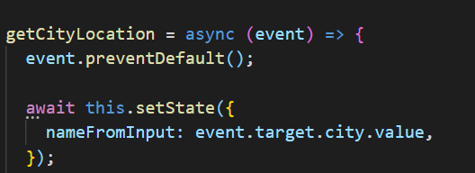

# White Box Testing 

White Box Testing is a software testing approach in which the underlying structure, architecture, and coding of software are examined to ensure that the input-output flow is correct and to enhance design, usability, and security. White-box testing is also known as Clear box testing, Open box testing, Transparent box testing, Code-based testing, and Glass box testing since code is visible to testers.

