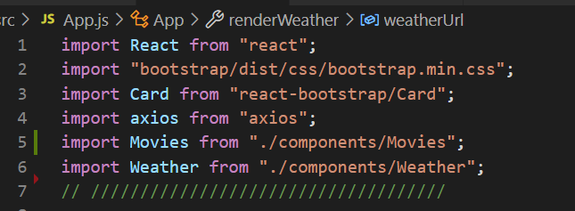
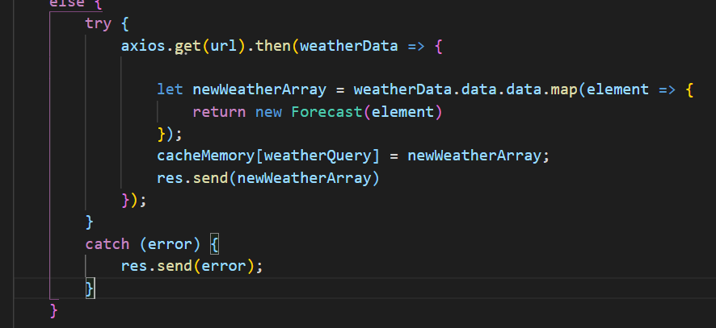
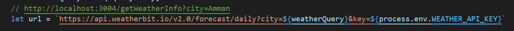
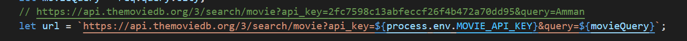
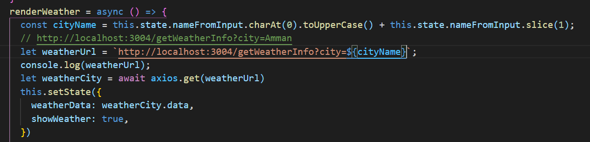
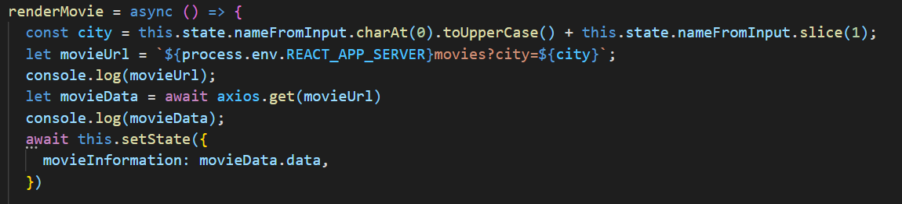
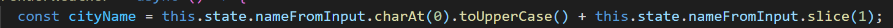

# White Box Testing 

White Box Testing is a software testing approach in which the underlying structure, architecture, and coding of software are examined to ensure that the input-output flow is correct and to enhance design, usability, and security. White-box testing is also known as Clear box testing, Open box testing, Transparent box testing, Code-based testing, and Glass box testing since code is visible to testers.

All libraries we needed to implement the code

Here I test if I have an error in the function by using try and catch

Then I test all links locally for my request if I have the right data of weather and movies by local bort and `consel.log()` 

movies

weather

we have the render  that will collect the forms sections lists or the structure that will appear to the user after the data that we need

here we create a variable to cover if the user use UpperCase or LowerCase

